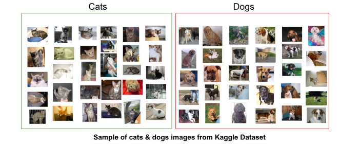

# Implementando uma CNN para reconhecimento de imagens

_O objetivo desse notebook é implementar uma rede neural convolucional que tem como função reconhecer se a imagem inputada é de um cachorro ou de um gato._

_Trabalho desenvolvido para a matéria de Técnicas para Descobertas do Conhecimento._  
**Grupo: Daniel Augusto, Douglas Abdo, Matheus Fialho e Rennan Haro.**

## Setup
_Utilizamos as bibliotecas [TensorFlow](https://www.tensorflow.org) e  [Keras](https://keras.io).  _

Para rodar o algoritmo em sua máquina utilizando o **`anaconda`**:
`conda install -r requirements.txt`

Para rodar o algoritmo em sua máquina utilizando o **`pip`**:
`pip install -r requirements.txt`

## Data
Encontre mais informações sobre o dataset utilizado e downloads adicionais [neste link](https://www.kaggle.com/c/dogs-vs-cats/data). 
Os datasets estão na pasta `data`. Consistem em basicamente 4 datasets (2 para treinar e 2 para testar), totalizando 2.800 imagens. 1.400 imagens de gatos e 1.400 imagens de cachorros. 

O split do dataset já foi feito.  
Temos em nosso dataset de treino 1.000 imagens de cachorros e 1.000 imagens de gatos.  
O nosso datset de teste, por sua vez, possui 400 imagens de cada. 

## License
Licensed under the MIT License. 2020.
